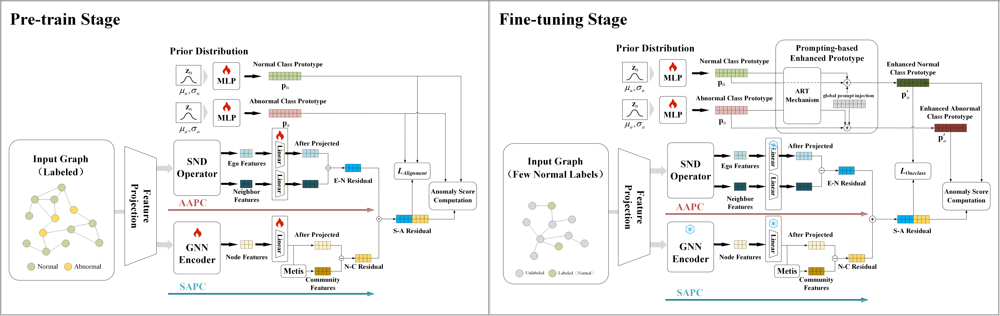

## Setup
Before running the code, please create the following directories in the project root:
- `data/`: For storing datasets.
- `pth/`: For saving pre-trained weights.
- `cache/`: For storing AAPC cache files.
- `saved_idx/`: For storing SAPC community partition results.

```setup
mkdir data pth cache saved_idx
```
## 📂 Data Preparation
The datasets after feature alignment for SAGAD can be obtained from [google drive link](https://drive.google.com/drive/folders/14xq1h8m6ZEyfFRvROAOEimHhvTAfp0fV?usp=sharing). 
1. Download the datasets.
2. Place them into the `data` folder.

> **Note:** The contents of the `cache`, `saved_idx`, and `pth` folders are automatically generated during runtime, so you do not need to create them manually.
## Requirements
To install requirements:

```setup
pip install -r requirements.txt
```
## Pre-training

To pretrain the model(s), run this command:
```
python pretrain.py 
```
## Few-shot fine-tuning
For fine-tuning with few-shot labeled normal nodes.

Run this command:
```
python finetune.py 
```
